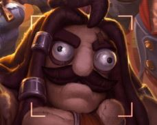

# 2022-3b min-han xie
## 2022-3b min-han xie
### 2022-3b min-han xie
#### 2022-3b min-han xie
##### 2022-3b min-han xie
###### 2022-3b min-han xie

This is a block needed to noticed `small`

:sleeping: :sleepy:




- [ ] todo list
- [x] done

```python
s = "Python isn't a xxxxx"
print(s)
```
